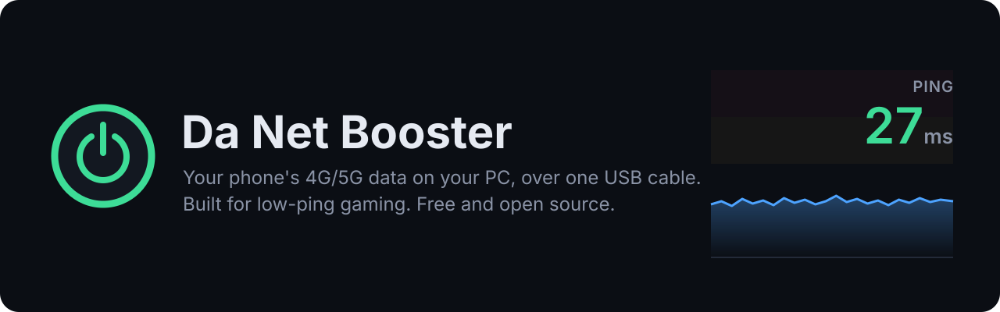
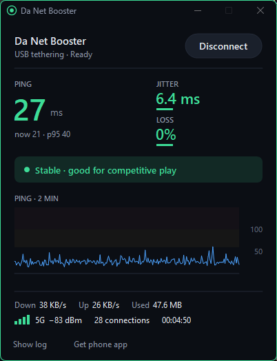
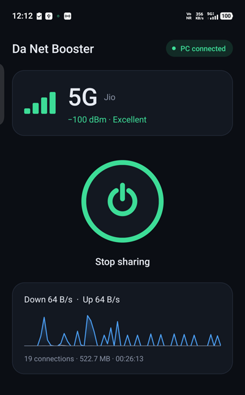
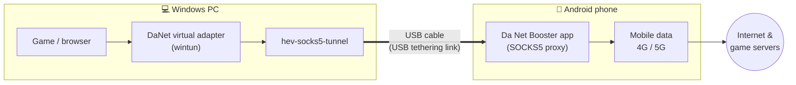
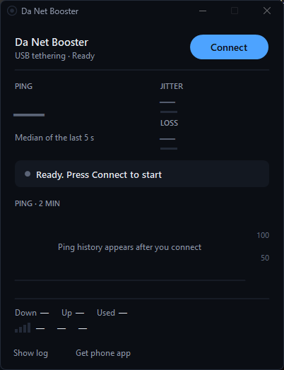
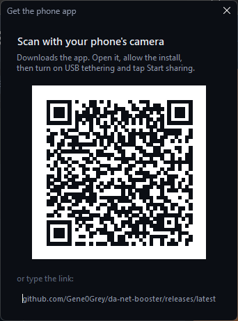

  

  
  
  
  
  

<h3 align="center">
  <a href="https://github.com/Gene0Grey/da-net-booster/releases/latest/download/DaNetBooster-win-Setup.exe">⬇ Download for Windows</a>
  &nbsp;·&nbsp;
  <a href="https://github.com/Gene0Grey/da-net-booster/releases/latest/download/DaNetBooster.apk">⬇ Android app (APK)</a>
</h3>

**Da Net Booster** is a free, open-source **PdaNet alternative** that shares your Android phone's mobile data (4G / 5G) with your Windows PC over a **USB cable**. It was built to fix the **high ping, jitter and packet loss you get when gaming on a phone hotspot** (tested with Valorant on Jio 5G). It also shows you, live, whether the lag comes from your connection or from the mobile tower.

No root. No USB debugging. No subscription. One installer for the PC, one app for the phone.

---

## Screenshots

  
  &nbsp;&nbsp;
  

Left: the PC app during a real match (ping graph = recorded probe data). Right: the phone app, live on Jio 5G.

## Why not just use the phone's hotspot?

| | Phone Wi-Fi hotspot | **Da Net Booster (USB)** |
|---|---|---|
| Link to the PC | Wi-Fi radio: interference, power saving, scanning | **USB cable**: steady, no radio in between |
| Extra delay added | Varies, spikes are common | **~2–3 ms** (measured, see below) |
| Tells you *why* it lags | No | **Yes**: live ping, jitter, loss and signal, and whether the problem is the tower or your link |
| Phone battery | Drains | **Charges** while you play |
| Protects your match | No | Updates and disconnects never drop a live game without asking |

## How it works

1. **The PC app** creates a virtual network adapter and routes all of the PC's traffic (TCP and UDP, so games and voice chat too) into it.
2. **The tunnel** carries that traffic over the USB cable. Android's *USB tethering* is used purely as the cable; nothing is shared through the phone's hotspot.
3. **The phone app** receives it and opens the real connections itself, over your mobile data. To the network, it is ordinary traffic from the phone.
4. Replies come back the same way. A small probe measures ping, jitter and loss every half second, so the dashboard shows exactly how your connection is doing.

## Measured, not guessed

Logged during real Valorant sessions on one phone (vivo, Jio 5G SA, India). The PC measured through the tunnel while the phone measured directly, at the same moment:

| Session | Through Da Net Booster | Phone alone (no PC) | Cost of the tunnel |
|---|---|---|---|
| Match, 8:15 pm | **27 ms** median · 43 ms p95 · **0% loss** | 25 ms · 37 ms · 0% | ~2 ms |
| 23 min, 10:04 pm | 32 ms · 80 ms p95 · 0.4% loss | 29 ms · 77 ms · 0% | ~3 ms |

The late-night spikes appeared on *both* sides at once. That is tower congestion, not the app, and the dashboard lets you tell the difference. Download speed over the USB link: ~2.8 MB/s, limited by the mobile network rather than by the cable.

## Get started

1. **PC:** download and run [`DaNetBooster-win-Setup.exe`](https://github.com/Gene0Grey/da-net-booster/releases/latest/download/DaNetBooster-win-Setup.exe). It installs the app, a desktop shortcut and .NET if needed.
   Windows may say "Windows protected your PC": click **More info → Run anyway** (the app isn't code-signed yet). It asks for admin rights because it creates a network adapter.
2. **Phone:** in the PC app click **Get phone app** and scan the QR code, or download the [APK](https://github.com/Gene0Grey/da-net-booster/releases/latest/download/DaNetBooster.apk) directly. Allow the install when Android asks.
3. Plug the phone in with USB and turn on **USB tethering**. The phone app has a **Turn on** button that takes you there.
4. Tap **Start sharing** on the phone, then **Connect** on the PC. Done.

  
  &nbsp;&nbsp;
  

## Features

- 🎮 **Gaming-first dashboard**: steady ping (median of the last 5 s), jitter, packet loss, a 2-minute ping graph with lag zones, and a plain-language verdict ("Stable · good for competitive play").
- 🟢 **Status you can read from across the room**: on Windows 11 the window border and taskbar icon turn green, amber or red.
- 📶 **Phone signal at a glance**: 4G/5G, signal strength and quality, a warning if the phone is on Wi-Fi, and a peak-hours hint.
- 🔌 **All traffic, not just the browser**: TCP and UDP, so games, Discord voice and DNS go through too.
- 🛡️ **Match-safe**: disconnect asks first, and updates only install when you're disconnected or closing the app.
- 🔄 **Automatic updates** for both apps from GitHub Releases.
- 🔒 **Private**: the phone only accepts connections from the PC on the USB link, never from Wi-Fi or the mobile network. No accounts, no telemetry (the only outside request is the update check to GitHub).

## FAQ

**How do I share my phone's internet with my PC over USB without a hotspot?**
Install both apps, turn on USB tethering, tap Start sharing, then click Connect. The PC's traffic goes over the cable to the phone, and the phone sends it out over mobile data.

**How can I reduce ping and packet loss on mobile data for Valorant (or CS2, Apex, Fortnite)?**
Use a cable instead of a hotspot: it removes the Wi-Fi hop, which is a common source of spikes. Then watch the graph. If spikes show up together with falling signal, move the phone (near a window, higher up). If the signal stays strong and ping still spikes in the evening, the tower is congested: try 4G-only vs 5G, or your other SIM.

**Is this like PdaNet+, EasyTether or FoxFi?**
Same idea (PC internet through the phone over USB, no root), but free and open source, with a live latency dashboard built for games. It is not affiliated with PdaNet, June Fabrics, EasyTether or FoxFi.

**Do I need USB debugging or root?**
No. USB debugging is only used by developers as a fallback link.

**Does it work on Mac or Linux?**
Not yet: the PC app is Windows 10/11 only.

**Will my carrier see this as tethering?**
The phone opens every connection itself, so the traffic looks like the phone's own. Your mobile plan's terms still apply, so check them.

## Build from source

For developers

- **Phone app:** `android/` (Kotlin, plain Android Views, no dependencies). `cd android && ./gradlew assembleDebug`
- **PC app:** `desktop/DaNetBooster/` (.NET 8 WinForms). Run `scripts/fetch-tools.ps1` once to download adb and hev-socks5-tunnel, then `dotnet build`.
- **Releases:** push a tag like `v1.4.0`. [`.github/workflows/release.yml`](.github/workflows/release.yml) tests and builds both apps, signs the APK and publishes the installer and APK to GitHub Releases, and installed apps pick up the update from there.

Built on [hev-socks5-tunnel](https://github.com/heiher/hev-socks5-tunnel), [Wintun](https://www.wintun.net/), [Velopack](https://velopack.io/) and [QRCoder](https://github.com/codebude/QRCoder).

---

Keywords: PdaNet alternative, free USB tethering for Windows, share mobile data with PC via USB, phone internet to laptop USB, internet sharing over USB cable, hotspot lag fix, high ping on mobile hotspot, Valorant packet loss on mobile data, low latency 5G gaming on PC, Jio 5G gaming, Airtel 5G gaming, SOCKS5 over USB, tun2socks, wintun, Android to PC internet sharing without root.
